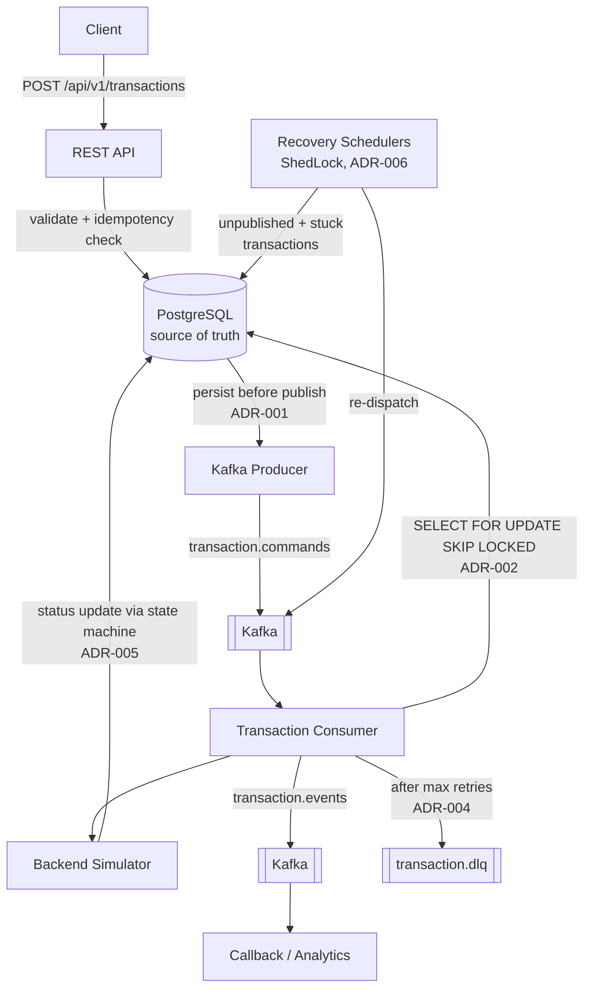
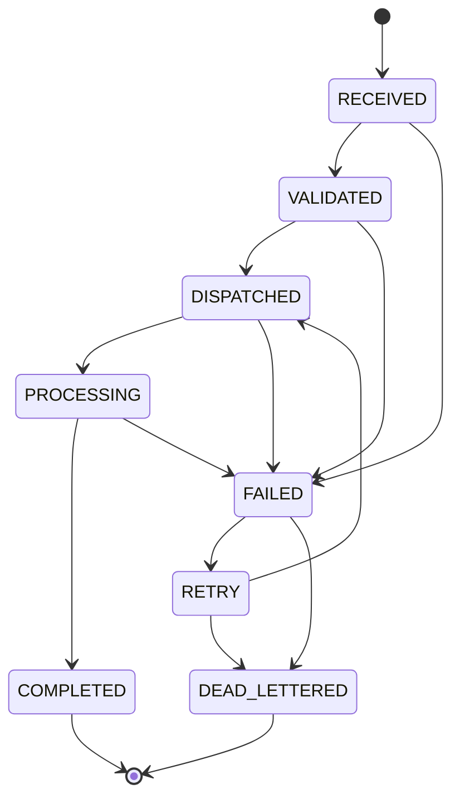

# Architecture

Event-driven transaction processing engine: a REST API accepts financial transaction commands (`CREDIT`, `DEBIT`, `REVERSAL`), persists them as the source of truth, and drives them through an asynchronous Kafka pipeline to completion — with idempotency, pessimistic locking, capped retries, dead-lettering, and automatic recovery.

Every non-obvious decision has an ADR in [`adr/`](adr/); this document is the map.

## High-level flow



## Status lifecycle



Enforced by a single `TransactionStateMachine` — any move outside this graph throws and maps to HTTP 409. `COMPLETED` and `DEAD_LETTERED` are terminal, marked by a custom `@Terminal` annotation cross-checked against the table at class-init (drift fails fast). Terminality is load-bearing: it's what makes reversal-eligibility checks race-free without locks (ADR-005, ADR-008). Stuck-transaction recovery deliberately walks `PROCESSING → FAILED → RETRY → DISPATCHED` rather than jumping back directly, so every recovery leaves an audit trace.

## Key patterns and where they live

| Concern | Pattern | ADR |
|---|---|---|
| Dual-write to DB + Kafka | Transactional outbox (state-based variant: `kafka_published` flag + recovery scheduler, partial index on unpublished rows) | [001](adr/001-persist-before-publish.md) |
| Concurrent consumers | `SELECT FOR UPDATE SKIP LOCKED` — work-queue semantics, no blocking, no deadlocks; optimistic `version` column guards cross-component writes separately | [002](adr/002-pessimistic-locking-skip-locked.md) |
| Client retries | Idempotency by `businessId` UNIQUE constraint; optimistic insert + catch, never check-then-insert; key reuse with a different payload → 409, not a silent 200 | [003](adr/003-idempotency-via-business-id.md) |
| Poison messages / retry exhaustion | Capped retries (shared `max-retries` for processing *and* publish failures) → DLQ topic + `DEAD_LETTERED` status + per-attempt `transaction_failure_audit` rows | [004](adr/004-kafka-dlq-strategy.md) |
| Lifecycle integrity | Explicit transition table, exhaustively tested (all 64 pairs), 409 on violation | [005](adr/005-state-machine-transitions.md) |
| Automatic recovery | Two ShedLock-guarded schedulers (unpublished, stuck) — single-instance execution per cycle | [006](adr/006-shedlock-recovery-scheduler.md) |
| Security | Locally-signed JWT resource server; every endpoint authenticated, reads included (financial data) | [007](adr/007-security-strategy.md) |
| Reversals | Append-only new record, FK to original, exactly-once per original via partial unique index, accounts must mirror the original's (swapped) | [008](adr/008-reversal-modeling.md) |

## Component map

```
com.patken.transaction
├── api/            TransactionController (implements the OpenAPI-generated interface),
│                   GlobalExceptionHandler (RFC 7807 problem+json)
├── domain/         Transaction (JPA), TransactionType, TransactionStatus, TransactionStateMachine
│   ├── annotation/ @Terminal
│   └── exception/  InvalidStateTransition, ReversalNotAllowed, TransactionNotFound, InvalidTransactionRequest
├── domain/         (also) TransactionFailureAudit (append-only per-attempt audit), FailureType
├── service/        TransactionCommandService (validation, idempotency), TransactionQueryService
│   └── mapper/     TransactionMapper (MapStruct, entity → response DTO)
├── persistence/    TransactionRepository (Spring Data JPA; lockForProcessing = SKIP LOCKED),
│                   TransactionFailureAuditRepository,
│                   TransactionGateway (create-path idempotent insert, ADR-003)
├── messaging/      producer/ + consumer/ (Kafka command/event flow, backend simulator);
│                   consumer/TransactionProcessor = the locked, transactional per-attempt unit
├── recovery/       StuckTransactionScheduler, UnpublishedTransactionScheduler (ShedLock)
├── observability/  CorrelationIdFilter (MDC), TransactionMetrics (Micrometer)
└── config/         Kafka, Retry, ShedLock, Security, Jackson
```

The API is **contract-first**: `src/main/resources/openapi/oas3.yaml` is the source of truth; controller interfaces and DTOs are generated at build time (`openapi-generator-maven-plugin`). Errors follow RFC 7807 (`application/problem+json`) with a single shared `Problem` schema.

## Data model

One `transactions` table — deliberately also the outbox (ADR-001) and the dead-letter state store (ADR-004: the DLQ *topic* preserves raw messages for replay; the *status* lives here, avoiding a second source of truth). Highlights:

- `business_id` UNIQUE — the idempotency backbone (ADR-003).
- `original_transaction_id` self-FK + `CHECK` (required iff `REVERSAL`) + partial unique index `uq_reversal_per_original` — reversal rules enforced at the DB level, where races actually get decided (ADR-008).
- `kafka_published` + partial index on `FALSE` — the outbox scan (ADR-001).
- `version` — optimistic locking for cross-component writes (ADR-002); post-publish flag updates bypass it via a targeted UPDATE to avoid colliding with consumer status writes.
- `amount NUMERIC(19,4)` — `BigDecimal` end to end; no floating point anywhere, including Kafka (de)serialization; request validation rejects scale > 4 rather than letting Postgres round silently.
- `created_at`/`updated_at` as `TIMESTAMPTZ` — recovery schedulers compare against `NOW()`; naive timestamps would shift recovery windows on any non-UTC server (ADR-006).
- `transaction_failure_audit` (one row per failed attempt, processing or publish) — full failure history without bloating the hot table; `transactions.error_message` keeps only the latest error for cheap access (ADR-004).

## Observability

Every log line carries `correlationId` (propagated HTTP → MDC → Kafka header → consumer), `transactionId`, `businessId`, and `status`. Micrometer counters/timers (created, completed, failed, dead-lettered, publish failures, stuck-recovered, end-to-end processing duration) are exposed on the Prometheus actuator endpoint. Health checks cover PostgreSQL, Kafka connectivity, and scheduler liveness.

## Testing strategy

Two tiers, no in-memory database anywhere:

- **Unit** (`unit/*Test`, Surefire, `mvn test`): no Spring context, no DB, mocked collaborators. Includes intent-pinning tests — e.g., the gateway must *not* pre-check before inserting (ADR-003), and the state machine test enumerates all 64 status pairs.
- **Integration** (`integration/*IT`, Failsafe, `mvn verify`): Testcontainers with real PostgreSQL and Kafka. H2 is deliberately banned: `SKIP LOCKED`, partial indexes, JSONB, and `gen_random_uuid()` are Postgres-specific and are precisely the behaviors worth testing.
